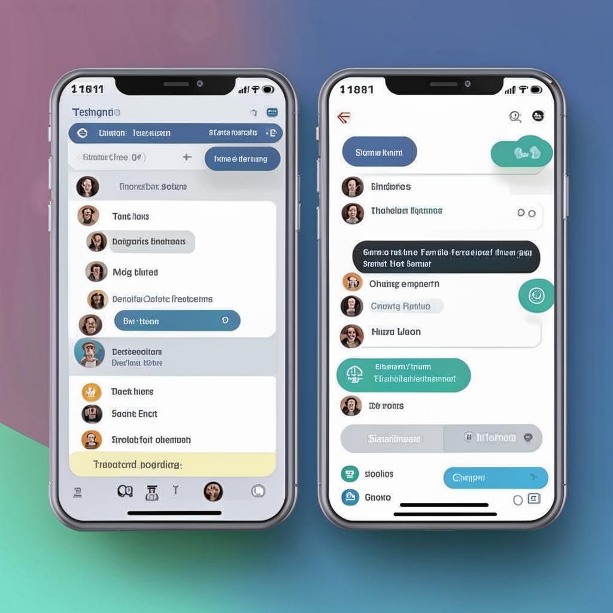

<h1 align="center"> &#127941; &#129504;  Hello, Researcher of Bot &#10004; &#129516; &#128295;   </h1>
  <h2 align="center">  <a href="https://github.com/yibibyte/GameBot.git" target="_blank">Get git Bot</a> or from <a href="https://gitverse.ru/sc/iluser/GameBot.git" target="_blank">Gitverse</a> </h2>
 
<h3 align="center">I'm developer and teacher, writer IT news </h3>
<h3 align="center">This Telegram bot</h3>
<h3 align="center">🇷🇺 Hello from Russia &#127479;&#127482;</h3>
<h3 align="center"> Contact me <a href="https://t.me/ilmanuser" target="_blank">telegram</a> </h3>
<h1 align="center"> </h1>

